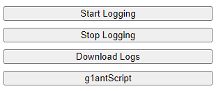

# Task Capture for RPA
Chrome extension which capture activities from the browser.
All logs are saved in database and may be downloaded.
Logs may be automaticly converted for G1ant.Studio script - RPA robot.

## Table of Contents
* [General Info](#general-information)
* [Technologies Used](#technologies-used)
* [Features](#features)
* [Screenshots](#screenshots)
* [Setup](#setup)
* [Usage](#usage)
* [Project Status](#project-status)
* [Room for Improvement](#room-for-improvement)
* [Acknowledgements](#acknowledgements)
* [Contact](#contact)

## General Information
- Provide general information about your project here.
- This is a tool, which RPA developers can use, to record webautomation. It also may be used by a clients, to record their process to automate.
- I started creating this tool, to speedup my work as RPA Developer - with this tool I can generate web automations automatically. Even if they are not perfect and need some polishment, it save much time

## Technologies Used
- JS
- HTML
- ChatGPT

## Features:
- Log user interactions as wheel-up/wheel-down, click, keyboard with xpath to the element on which action has been done. Also logs current url and timestamp
- Log activities within tabs such as opening new tab, setting url, closing, activating or refreshing tab
- Create g1ant.studio script
- Possibility to download logs

## Screenshots

## Setup
1. Copy repository
2. Open Chrome brower on url "chrome://extensions/"
3. In the top right corner of the Extensions page, enable the "Developer mode" toggle.
4. Click on "Load unpacked."
5. A file dialog will appear. Navigate to the location of 'ChromeExtension' in the folder with repository.
6. Google Chrome will now install the extension from your disk. Once the installation is complete, you should see the extension listed among your installed extensions on the Extensions page.

## Usage
Click button 'Start Logging' to start. Extension will start to gather your activities in Chrome.
Click button 'Stop Logging' to disable gathering activities.
Click button 'Download Logs' to download text file with all recorded logs.
Click button 'g1antScript' to generate g1ant.Script. For now it appears in developers console.

## Project Status
Project is: _in progress_

## Room for Improvement
Room for improvement:
- Clean the code. Do code refactoring.
- Remove scroll listener
- Fix loging keydown events (for now its f.e. 'ShiftD', change to -> 'D'
- Create friendly UI

To do:
- Add possibility to download G1ant.Script as a file
- Fix G1ant parser
- Add python parser with possibility to download python script as a file
- Add logic of checking previous xpath before logging wheel event
- Add logic of getting url of closed tab
- Add tab id's to logs
- Add 'Clear Logs' button. Ask before starting loging if user would like to delete all previous logs.
- Add whole html code to logs for further usage with ChatGPT
- Change logic of starting and stopping -> create toggle button instead of two buttons
- [MAYBE] Add JS Selectors to logs.

## Acknowledgements
- Many thanks to whole G1ant team who inspired my to develop my programming skills.

## Contact
Created by Kacper Borowiecki